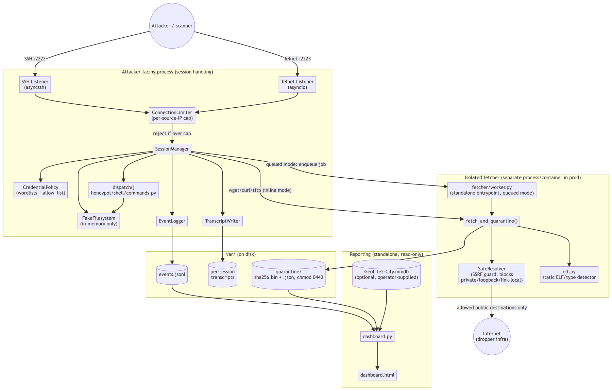

# RISC-V Medium-Interaction Honeypot

A medium-interaction SSH/Telnet honeypot that impersonates a RISC-V Linux
IoT/embedded device, built to attract and record Mirai-style malware-dropper
activity and safely capture any binaries dropped against it -- **without
ever executing them**. See `riscv-honeypot-spec.md` for the full design spec
this implementation follows, and `SAFETY.md` for the non-negotiable safety
guarantees and how the code enforces them.

## Architecture



(Source: `docs/architecture.mmd` -- edit that and re-render if the
architecture changes; see the comment at its top for how.)

`AttackerFacing` and `FetcherProc` are two separate OS processes in production
(`fetcher.mode: queued` + `docker-compose.yml`, see "Deploying safely" below)
with no network route between them -- the only thing they share is the
`var/jobs/` file-based queue (not shown above; see `SAFETY.md` guarantee #2).
`Reporting` is a separate, read-only tool you run on demand; it's never
imported by or running alongside the listeners.

## Installation

Requires Python 3.11+ (the codebase uses `X | Y` union type hints and
`asyncio.TaskGroup`, both 3.11+). No system packages are needed -- unlike the
spec's suggestion of `python-magic`/libmagic, this implementation uses a
hand-rolled static ELF parser (`honeypot/fetcher/elf.py`) specifically to
avoid a native-library dependency.

```
git clone <this repo>            # or just cd into it if already local
cd risc-v_honeypot
python3 -m venv .venv
source .venv/bin/activate
pip install -e '.[dev]'          # editable install + asyncssh/aiohttp/pydantic/pyyaml + pytest
```

Omit `[dev]` (`pip install -e .`) for a runtime-only install with no test
dependencies -- useful on a deployment host that will only ever run
`honeypot.main` or `honeypot.fetcher.worker`, never `pytest`.

Verify the install:

```
pytest -q
```

All tests should pass, including `tests/test_no_dangerous_calls.py` (see
"Test" below). If `pip install` fails building `cryptography` (an `asyncssh`
dependency) on an unusual platform, that's the one component that may need a
system C toolchain / OpenSSL headers; every other dependency ships prebuilt
wheels.

## Running

```
python -m honeypot.main configs/riscv64.yaml
```

or `configs/riscv32.yaml` for the 32-bit persona. This runs in the
foreground and logs startup ("SSH listener on ...", "Telnet listener on
...") to stderr; stop it with Ctrl-C (or `kill` the process/`systemctl stop`
if you've wrapped it in a unit -- there's no separate daemonization step in
the codebase itself, so use your process supervisor of choice for
backgrounding/restart-on-crash).

By default this binds SSH on `2222` and Telnet on `2223` on all interfaces
(`listeners.bind_host: 0.0.0.0` in the config). To use the standard `22`/`23`
without running as root, either:

- grant the interpreter the capability once: `sudo setcap
  'cap_net_bind_service=+ep' "$(readlink -f .venv/bin/python3)"`, then set
  `ssh_port: 22` / `telnet_port: 23` in the config, or
- front it with a systemd socket unit / port-forwarding rule instead of
  changing the app's bind ports at all.

Any username/password is accepted by default (`credentials.accept_any: true`
in the config) to maximize capture of credential-stuffing attempts; set it to
`false` and populate `allow_list` to restrict to specific default IoT creds.

While it's running, everything lands under `var/`: `var/logs/events.jsonl`
(structured events), `var/transcripts/<session_id>.jsonl` (raw per-session
I/O), and `var/quarantine/` (captured samples + JSON sidecars) -- see
"Structured logs" and "Reviewing captured samples" below. Confirm it's
actually listening with `ss -ltnp | grep -E ':(2222|2223)'` (or your
configured ports).

Running both riscv32 and riscv64 personas side by side (two config files,
two sets of ports, or two hosts) lets you compare what droppers serve to
each architecture. For running the fetcher as a separate, network-isolated
process instead of in-process, see "Deploying safely" below.

## Training mode

Want to poke at the honeypot yourself -- log in, run commands, trigger a
fake download -- without any deployment setup? `configs/training.yaml` is
bound to `127.0.0.1` **only** (never your LAN or the internet, regardless of
what network you're on) and accepts any username/password, so there's
nothing to configure first:

```
python -m honeypot.main configs/training.yaml
```

In another terminal, play attacker over SSH:

```
ssh -p 2222 root@127.0.0.1
```

(any password works; accept the new host-key prompt). Or Telnet:

```
telnet 127.0.0.1 2223
```

Things worth trying once you're in, to see how each is handled:

```
uname -a                              # persona banner
cat /proc/cpuinfo                     # persona hardware fields
ls -la /bin                           # long listing, applets shown as executable
ifconfig                              # or: ip a
grep root /etc/passwd                 # or: sed s/root/toor/ /etc/passwd, awk '{print $1}' /etc/passwd
wget http://example.invalid/x -O m    # download attempt -- logged even though the fetch will fail
chmod +x m                            # execution attempt: acknowledged silently, nothing actually runs
./m                                   # same -- logged as file.execution_attempt, never executed
wget --help                           # any implemented command's --help -- see honeypot/shell/help_text.py
whatever-nonsense-command             # busybox-style "not found"
exit
```

To actually see a successful download-and-quarantine round trip rather than
a connection failure, serve a real (harmless) file locally in a third
terminal first:

```
mkdir -p /tmp/fake-payload && head -c 200 /dev/urandom > /tmp/fake-payload/mal.riscv64
python3 -m http.server 8000 --directory /tmp/fake-payload --bind 127.0.0.1
```

then `wget http://127.0.0.1:8000/mal.riscv64 -O mal` from inside the
honeypot session -- you'll get a busybox-style "saved" response, and the
file will land in `var/training/quarantine/<sha256>.bin` (mode `0440`) with
a `.json` sidecar next to it.

Everything lands under `var/training/` (`logs/events.jsonl`,
`transcripts/<session_id>.jsonl`, `quarantine/`) -- a separate tree from
`var/`, so training runs never mix with real capture data. `tail -f
var/training/logs/events.jsonl` in a spare terminal while you type commands
is the fastest way to see exactly what gets recorded for each action.

## Test

```
pytest
```

`tests/test_no_dangerous_calls.py` is the CI-runnable static-analysis check
required by the spec: it fails the build if `os.system`, any `os.exec*`, a
`subprocess` call with `shell=True`, or the `eval`/`exec` builtins appear
anywhere under `honeypot/`.

## Deploying safely

**Read `SAFETY.md` first.** The single most important deployment decision is
where the fetcher runs and which fetch `mode` the config uses. With
`fetcher.mode: inline` (the default in `configs/riscv64.yaml`/`riscv32.yaml`),
`honeypot/session/manager.py` awaits the fetch in-process -- fine for a single
isolated VM used only for experimentation, but the session process itself
performs the outbound request in that mode. For anything facing real attacker
traffic, switch to `fetcher.mode: queued` (see `configs/riscv64-docker.yaml`/
`riscv32-docker.yaml` for a working example) and:

1. Run the session-handling process (this repo's `honeypot.main`) on an
   isolated VM/container with no sensitive network access at all -- assume it
   will be fully compromised in spirit (it accepts arbitrary input by design).
2. Run the fetcher as a **separate process**, via
   `python -m honeypot.fetcher.worker configs/riscv64-docker.yaml`, on a host
   or in a network namespace whose only permitted egress is the public
   internet (to reach attacker-controlled dropper infrastructure) and which
   has **no route back** to the honeypot's management/logging/storage
   network. It only needs write access to the shared `fetcher.jobs_dir` /
   `fetcher.quarantine_dir` locations.
3. Never expose `var/quarantine/` to anything that opens files for execution.
   Quarantined samples are written `chmod 0440` specifically so that even a
   misconfigured tool can't accidentally run them.
4. Treat every file under `var/quarantine/` as live malware. Reviewing a
   sample should never mean running it (see "Reviewing captured samples"
   below).

See "Firewall and ports" below for exactly what needs to be open in each
direction for this two-process split.

### Deploying with Docker Compose

`docker-compose.yml` implements the two-process split above as two
containers that share **no Docker network** -- the only channel between them
is the bind-mounted `./var/jobs` directory, so there is no IP path from the
fetcher container (which reaches attacker-controlled infrastructure by
design) back to the honeypot container. This has been built and
live-tested: a real login → `wget` → quarantine round trip through the
`honeypot` container, with the actual fetch happening only inside the
`fetcher` container, and a direct connection attempt from the `honeypot`
container to the `fetcher` container's IP confirmed to time out.

```
mkdir -p var/jobs var/quarantine var/logs var/transcripts var/keys
sudo chown -R 10001:10001 var       # both containers run as fixed UID 10001
sudo chmod 700 var/keys             # holds the SSH host key -- see "SSH host key" below
docker compose up -d
docker compose logs -f              # both services' stdout/stderr
```

This uses `configs/riscv64-docker.yaml` (edit `docker-compose.yml`'s two
`command:` lines to switch to `riscv32-docker.yaml`). Privileged ports work
directly through Docker's `ports:` mapping (e.g. change `"2222:2222"` to
`"22:2222"`) -- no `setcap` needed in this deployment path. See the comments
at the top of `docker-compose.yml` for the full rationale, and harden the
`egress` network's actual internet access at your host firewall per point 2
above -- Docker's network separation here stops the fetcher from reaching
the honeypot container, but a host firewall is still the right place to
constrain what the fetcher's egress network can reach on your real network.

### SSH host key

The honeypot's SSH host key is generated once and reused, so the fingerprint an
attacker sees stays the same across restarts and rebuilds -- a device whose key
changes between visits is a tell. In the Docker deployment it lives in
`var/keys/`, which `docker-compose.yml` bind-mounts from the host (the
`docker-compose.yml` header has the one-time `mkdir`/`chown`/`chmod`). Bare-metal
runs keep it at `var/ssh_host_key`.

If the key directory is missing or not writable by UID 10001, the honeypot
still starts -- an unreachable honeypot is worse than a changing fingerprint --
on a **temporary in-memory key**, and logs `SSH host key ... is unusable` at
`ERROR`. After deploying, check that `docker compose logs honeypot | grep -E "host key .* unusable"`
prints nothing. (Don't grep for a bare "host key": asyncssh logs an ordinary
INFO line, `Sending server host keys disabled`, for every connection.) An
existing key file that can't be read or parsed is left untouched, never
overwritten.

To confirm the fingerprint survives a rebuild, compare the one the server
presents before and after. Use the *published* port -- `docker compose port
honeypot 2222` prints it, and it isn't 2222 if you mapped `22:2222`:

```
PORT=$(docker compose port honeypot 2222 | cut -d: -f2)
ssh-keyscan -t rsa -p "$PORT" 127.0.0.1 2>/dev/null | ssh-keygen -lf -
```
`(stdin) is not a public key file` means keyscan got nothing back (wrong port).

To keep the key of a deployment that predates this (it was generated inside the
container and would otherwise be lost on the next rebuild), copy it out first:

```
mkdir -p var/keys
docker compose cp honeypot:/app/var/ssh_host_key var/keys/ssh_host_key
sudo chown -R 10001:10001 var/keys && sudo chmod 700 var/keys && sudo chmod 600 var/keys/ssh_host_key
```

## Firewall and ports

| Direction | Port | Component | Required? | Notes |
|---|---|---|---|---|
| Inbound | `2222/tcp` (config: `listeners.ssh_port`) | honeypot | Required | SSH bait. Remap to `22` in the config (bare metal, needs `setcap`) or via Docker's `ports:` mapping (no `setcap` needed) -- see "Running"/"Deploying with Docker Compose". |
| Inbound | `2223/tcp` (config: `listeners.telnet_port`) | honeypot | Required | Telnet bait. Same remap options, target `23`. |
| Outbound | any TCP port, destination = attacker-supplied URL | fetcher | Required | The fetcher must reach whatever host:port a dropper's `wget`/`curl` URL names. **Don't restrict this to 80/443** -- Mirai-style droppers routinely serve payloads on non-standard ports specifically to dodge that assumption, and narrowing it would silently drop real capture opportunities. Restrict *destination* instead: this network must have internet egress but **no route to your internal/management network or the honeypot's own segment** (SAFETY.md guarantee #5). |
| Outbound | none required | honeypot | N/A | The session process itself should need **no** outbound access once `fetcher.mode: queued` is set -- it only writes to the local/shared `var/jobs` path, never dials out. If you're still on `fetcher.mode: inline` (single-process dev mode), the session process performs the fetch itself and needs the same broad outbound TCP access described above; move to `queued` mode specifically to avoid giving the attacker-facing process any outbound path at all. |
| Inbound | none required | fetcher | N/A | Nothing ever initiates a connection to the fetcher; don't publish or forward any port to it. |

Two deployment-specific notes:

- **Docker Compose** (see "Deploying with Docker Compose" above): the table above maps directly to `docker-compose.yml`'s `ports:` (only on the `honeypot` service) and the `public`/`egress` network split -- there is nothing else to open at the host firewall for the containers themselves. Still add host-level egress filtering on whatever interface backs the `egress` Docker network if your organization requires firewall enforcement independent of Docker's own network isolation (SAFETY.md guarantee #5 is explicit that this should not depend on Docker/app-level isolation alone).
- **Bare-metal two-host split**: if `fetcher.jobs_dir`/`fetcher.quarantine_dir` are shared between the session and fetcher hosts over the network (NFS, SSHFS, rsync-over-SSH, etc. -- the codebase itself doesn't implement this, it's a filesystem-sharing choice you make at deploy time), open *that* transport's port (e.g. `2049/tcp` for NFS, `22/tcp` for SSHFS/rsync) only on a private link between the two honeypot hosts, never on a route reachable from the internet or from the fetcher's dropper-facing egress network.

## Deploying on DigitalOcean

Two concrete walkthroughs, corresponding to the two isolation levels
described in "Deploying safely" above. Both assume Ubuntu 24.04 x64
Droplets and a repo clone at `~/risc-v_honeypot` on each host.

### Option A: single Droplet (cheap, Docker-network isolation only)

1. **Create the Droplet**: Basic plan, 1 vCPU / 1GB RAM is enough (the fake
   shell and fetcher are lightweight; go to 2GB if you want headroom),
   Ubuntu 24.04 LTS, any region.
2. **Move real admin SSH off port 22** so the honeypot can use it for bait
   (skip this if you're fine leaving the SSH bait on `2222`):
   ```
   sudo sed -i 's/^#\?Port .*/Port 2200/' /etc/ssh/sshd_config
   sudo systemctl restart ssh
   ```
   Test the new port works in a *second* terminal before closing the
   firewall on 22 -- don't lock yourself out.
3. **Install Docker**:
   ```
   curl -fsSL https://get.docker.com | sudo sh
   ```
4. **Get the code onto the Droplet** (`git clone` your repo, or `scp -r`
   this directory) to `~/risc-v_honeypot`, then:
   ```
   cd ~/risc-v_honeypot
   mkdir -p var/jobs var/quarantine var/logs var/transcripts var/keys
   sudo chown -R 10001:10001 var
   sudo chmod 700 var/keys
   ```
5. **If you moved SSH to 2200**, edit `docker-compose.yml`'s `honeypot`
   service to publish the real ports:
   ```yaml
       ports:
         - "22:2222"
         - "23:2223"
   ```
6. **Configure the DigitalOcean Cloud Firewall** (Networking -> Firewalls in
   the control panel, or `doctl compute firewall create`) and attach it to
   the Droplet:
   - Inbound: TCP `22` from `0.0.0.0/0, ::/0` (SSH bait -- or `2222` if you
     skipped step 2/5)
   - Inbound: TCP `23` from `0.0.0.0/0, ::/0` (Telnet bait -- or `2223`)
   - Inbound: TCP `2200` (or whatever you chose) from **your own IP only**
     (real admin SSH)
   - Outbound: leave DigitalOcean's default "allow all" -- the fetcher
     needs broad outbound TCP per "Firewall and ports" above, and DO
     firewalls are inbound-focused by default (no outbound rules = allow
     all).
7. **Bring it up**:
   ```
   sudo docker compose build
   sudo docker compose up -d
   sudo docker compose logs -f
   ```
8. **Verify**: `sudo docker compose ps`, then from your own machine try
   logging into the bait ports and confirm `var/logs/events.jsonl` fills in.
9. **Pull samples off periodically** with `rsync`/`scp` from your own
   machine (`sudo` is needed to read `var/quarantine/` locally on the
   Droplet, since it's owned by UID 10001 at mode `0440`):
   ```
   rsync -avz -e ssh root@<droplet-ip>:~/risc-v_honeypot/var/quarantine/ ./quarantine/
   ```

Isolation here is Docker-network-level only (verified earlier in this
project: the `honeypot` container cannot reach the `fetcher` container's
IP) -- both containers still share the same Droplet, kernel, and physical
network interface. Good enough for the spec's v1 posture; for the stronger
guarantee, use Option B.

### Option B: two Droplets in a VPC (matches SAFETY.md guarantee #5)

Runs `honeypot` and `fetcher` as separate services on separate Droplets, so
there is no shared kernel or NIC between them at all -- the only link is one
NFS export, opened only between their private VPC IPs.

1. **Create a VPC** (Networking -> VPC) in one region, then **create two
   Droplets in it** -- `honeypot-session` and `honeypot-fetcher` -- same
   region, same VPC, each gets a private IP automatically (e.g.
   `10.116.0.2`/`10.116.0.3`). Repeat steps 1-4 from Option A on **both**
   Droplets (Docker install, repo clone to `~/risc-v_honeypot`, `mkdir -p
   var/... var/keys && chown -R 10001:10001 var`). Only `honeypot-session` needs the
   SSH-port-move from Option A step 2 (it's the only one with a public bait
   surface).
2. **Share `var/jobs` between them over the private network.**
   `honeypot-session` exports it via NFS; `honeypot-fetcher` mounts it as a
   client -- this direction means only `honeypot-fetcher` ever initiates a
   connection, so `honeypot-fetcher` still needs **zero** inbound rules of
   its own.
   - On `honeypot-session`:
     ```
     sudo apt install -y nfs-kernel-server
     echo "$HOME/risc-v_honeypot/var/jobs <fetcher-private-ip>(rw,sync,no_subtree_check,no_root_squash)" | sudo tee -a /etc/exports
     sudo exportfs -ra
     sudo systemctl enable --now nfs-kernel-server
     ```
   - On `honeypot-fetcher`:
     ```
     sudo apt install -y nfs-common
     sudo mkdir -p ~/risc-v_honeypot/var/jobs
     echo "<session-private-ip>:$HOME/risc-v_honeypot/var/jobs $HOME/risc-v_honeypot/var/jobs nfs rw,auto 0 0" | sudo tee -a /etc/fstab
     sudo mount -a
     ```
   `var/quarantine` stays **local** to `honeypot-fetcher` only -- it's never
   shared back, matching the existing design where the session side never
   touches captured samples.
3. **Cloud Firewall for `honeypot-session`**: same three inbound rules as
   Option A step 6 (SSH bait, Telnet bait, your IP on the admin SSH port).
   Add nothing for NFS -- `honeypot-fetcher` connects to it as a client, so
   the rule goes on `honeypot-session`'s firewall as an **inbound** allow for
   TCP `2049` (and `111` for NFS's portmapper) from `honeypot-fetcher`'s
   private IP only. VPC private IPs aren't internet-routable regardless, so
   this is already unreachable from the public internet.
4. **Cloud Firewall for `honeypot-fetcher`**: no inbound rules at all
   (leave DO's default-deny for anything not explicitly allowed); outbound
   left at DO's default allow-all, per "Firewall and ports" above.
5. **Bring each service up on its own Droplet** (build first -- each
   Droplet builds its own local image from the same Dockerfile):
   ```
   # on honeypot-session:
   sudo docker compose build honeypot
   sudo docker compose up -d honeypot

   # on honeypot-fetcher:
   sudo docker compose build fetcher
   sudo docker compose up -d fetcher
   ```
   (`docker-compose.yml` defines both services in one file; `up -d
   <service>` starts only the one you name -- the unused service's network
   still gets created but nothing runs on it.)
6. **Verify**: watch `sudo docker compose logs -f` on both; confirm a test
   `wget` from the bait shell produces a job file in
   `~/risc-v_honeypot/var/jobs` on `honeypot-session` and a quarantined file
   appears in `~/risc-v_honeypot/var/quarantine` on `honeypot-fetcher`.

## Log rotation and cleanup

Nothing in the codebase rotates or prunes `var/` on its own -- left running
against real internet traffic, `var/logs/events.jsonl` grows forever and
`var/transcripts/`/`var/jobs/.processing/` accumulate one file per
session/job forever. `var/quarantine/` is deliberately exempt from all of
this: those are captured samples, and deleting one should always be a human
decision, never an automated one.

`deploy/logrotate-riscv-honeypot.conf` handles the single ever-growing file
(`events.jsonl`); `deploy/cleanup-var.sh` handles the many-small-files case
(transcripts, stale job/result files) that logrotate isn't the right tool
for. Install both once, on whichever host(s) actually have a `var/`
directory (both Droplets, in the two-Droplet split):

```
sudo sed 's#/root/risc-v_honeypot#'"$HOME"'/risc-v_honeypot#' \
  deploy/logrotate-riscv-honeypot.conf | sudo tee /etc/logrotate.d/riscv-honeypot
sudo logrotate --debug /etc/logrotate.d/riscv-honeypot   # dry run, confirm no errors

sudo crontab -e
# add this line (adjust the path if you didn't clone to ~/risc-v_honeypot):
0 3 * * * /root/risc-v_honeypot/deploy/cleanup-var.sh >> /var/log/riscv-honeypot-cleanup.log 2>&1
```

Defaults: transcripts older than 30 days and job/result files older than 7
days are deleted; override with `TRANSCRIPT_RETENTION_DAYS=N`/
`JOB_RETENTION_DAYS=N` env vars on the cron line. `DRY_RUN=1
./deploy/cleanup-var.sh` shows what would be deleted without deleting
anything -- run that once by hand after installing to sanity-check it
before trusting the cron job.

## Further hardening: egress restriction and patch reminders

Two smaller defense-in-depth measures worth setting up once the Docker
Compose deployment is running, both under `deploy/`:

**`restrict-honeypot-egress.sh` + `.service`** -- the `honeypot` container
has no legitimate outbound need at all once `fetcher.mode: queued` is set
(see "Firewall and ports" above); this blocks it from *initiating* any
outbound connection at the host firewall, so a hypothetical future
code-level compromise of that container (not attacker payload execution,
which the codebase prevents by design -- a bug in our own Python or in
asyncssh/aiohttp itself) can't be used to reach out and join further
attacks. Inbound attacker traffic and replies to it are unaffected (a
reply within an already-accepted connection isn't a new connection
attempt).

```
sudo cp deploy/restrict-honeypot-egress.service /etc/systemd/system/
sudo systemctl daemon-reload
sudo systemctl enable --now restrict-honeypot-egress.service
sudo iptables -L DOCKER-USER -n   # confirm the DROP rule for the public network's subnet is there
```

**`check-for-updates.sh`** -- `Dockerfile`'s `FROM python:3.11-slim` and
`pyproject.toml`'s `>=`-pinned dependencies (asyncssh, aiohttp, pydantic,
PyYAML) only get their security patches when you actually rebuild; an
image built once and left running indefinitely accumulates unpatched CVEs
silently. This never rebuilds anything itself -- it only tells you when a
rebuild or `git pull` is worth doing:

```
sudo crontab -e
# add:
0 4 * * 1 /root/risc-v_honeypot/deploy/check-for-updates.sh >> /var/log/riscv-honeypot-updates.log 2>&1
```

## Reviewing captured samples

Each quarantined file `var/quarantine/<sha256>.bin` has a JSON sidecar
`var/quarantine/<sha256>.json` with: source session ID, source IP, requested
URL, protocol, timestamp, size, SHA256 + MD5, detected file type
(`honeypot/fetcher/elf.py` does the static detection -- ELF class/machine/
endianness or a magic-byte guess for non-ELF files), and, when the sample is
an ELF RISC-V binary, whether its bitness matched the persona that received
it (`arch_mismatch`) -- a dropper serving the wrong arch is itself signal
worth investigating.

To look at what was captured without ever executing it:

- Hash lookup: take the `sha256`/`md5` field from the sidecar to VirusTotal /
  MalwareBazaar / any-run, etc.
- Static disassembly only: tools like `objdump -d`, Ghidra, or IDA in
  "load, don't run" mode are fine; anything that maps the sample into a
  running process (a real `file` invocation that could follow symlinks
  strangely, an antivirus "quick scan" that lightly executes heuristics,
  a sandbox detonator) belongs in a separate, deliberately-provisioned
  detonation environment -- not this repo, and explicitly out of scope for
  this build (see spec sec 7).
- The raw session transcript at `var/transcripts/<session_id>.jsonl` (one
  JSON object per line: `timestamp`, `direction` (`recv`/`send`), `data_b64`)
  shows exactly what the attacker typed and received around the download, in
  order, for correlating the dropper's full playbook with the sample it left
  behind.

## Structured logs

`var/logs/events.jsonl` (one JSON object per line) covers `session.connect`,
`session.closed`, `login.success`/`login.failed`, `command.input`,
`file.download` (a `"requested"` event logged immediately, even before the
fetch completes, plus a follow-up `"success"`/`"failed"` event with the
outcome), and `file.execution_attempt`. Also logged: `session.client_version`
(the SSH client's banner), `auth.attempt` (public keys offered, with
fingerprints, and "none" probes that never tried a credential),
`file.stage2_scan` (a fetched script was scanned for follow-on URLs), and
`honeypot.heartbeat`. Ship this to a SIEM by tailing the
file, or extend `honeypot/logging/events.py` with a forwarding sink -- the
spec deliberately keeps this pluggable rather than building a forwarder for
v1.

**Heartbeat and log rotation.** A public honeypot is knocked on every few
minutes around the clock, so a long gap in the log means the process stopped
-- but only if the log can say "still here" when nobody connects. The
honeypot writes `honeypot.heartbeat` (with `uptime_seconds`) at startup, so
each restart leaves a marker with uptime near 0, and then every
`logging.heartbeat_seconds` (default 300; `0` disables). Separately,
logrotate (`deploy/logrotate-riscv-honeypot.conf`) renames `events.jsonl` to
`events.jsonl.1` at midnight UTC and gzips older days as `events.jsonl.2.gz`,
`.3.gz`, ... -- so `tail events.jsonl` (or a copy of just that file) shows
only "today so far", and a fresh rotation looks exactly like the honeypot
going quiet. `tools/dashboard.py`, `dashboard_server.py` and `status_check.py`
therefore read the rotated siblings of the file you name too, oldest first
(`--no-rotated` to look at the named file alone).

## Dashboard

Three ways to view `var/logs/events.jsonl` as a report instead of raw
JSONL -- all under `tools/`, deliberately outside the `honeypot` package
for the same reason as everywhere else in this README: CLAUDE.md / the
build spec mark a web dashboard as out of scope for the honeypot itself,
so these are separate, read-only consumers of the logs, never imported by
or running alongside the listeners. All three agree on the numbers --
`dashboard_server.py` and `status_check.py` both reuse `dashboard.py`'s
`Report` for aggregation rather than each computing their own.

**Quick CLI glance** (`tools/status_check.py`, no extra install needed):
plain-text summary -- session/IP volume, login success rate, command
patterns grouped across successful logins (what actually distinguishes a
harvester that sends nothing from real recon from a weaponization
attempt), download attempts, and repeat visitors. Good for a fast check
without a browser at all -- including straight on a bare Droplet host,
where the other two tools can't run without first creating a venv (a bare
host's system Python refuses `pip install` directly -- Debian/Ubuntu's
PEP 668 `externally-managed-environment` protection).

```
python3 tools/status_check.py --events var/logs/events.jsonl
python3 tools/status_check.py --events var/logs/events.jsonl --exclude-ip <your-own-testing-ip>
```

Besides the volume and login numbers it summarises the SSH side: which client
banners connect (`session.client_version`), non-password auth attempts and any
public key offered from more than one source IP (a shared campaign or toolkit),
and sessions held open for over 30 seconds that never tried a login or command.
Everything taken from the log -- usernames, URLs, banners -- is attacker-controlled,
so control characters and bidi overrides are printed as visible `\xNN`/`\uNNNN`
escapes instead of being sent to your terminal.

Its output starts with a `Newest event` line (how long ago anything was last
logged, measured against the whole log so `--exclude-ip` can't hide it) and a
`WARNING` after `--stale-minutes` (default 30) of silence -- if this is the live
log, the honeypot may be down. Rotated logs next to the one you name are read
too; it says so on stderr.

Use `--events`, not the `configs/riscv64.yaml` positional-arg form, when
running this directly on a bare Droplet host: the config form resolves the
log path by importing `honeypot.config`, and that package isn't installed
on the host's system Python at all (it only exists inside the Docker
image) -- `--events` sidesteps needing the package entirely, which is the
whole point of reaching for this tool there. The config form still works
fine wherever `honeypot` *is* importable (the venv from "Installation"
above, or one made just for `tools/`, per `pip install -e
'.[dashboard-server]'` below).

**Static, one-shot** (`tools/dashboard.py`, `pip install -e '.[dashboard]'`):
renders a single self-contained HTML file you open in a browser; re-run it
whenever you want a fresh snapshot.

```
python3 tools/dashboard.py configs/riscv64.yaml --geoip var/GeoLite2-City.mmdb --out var/dashboard.html
```

**Live** (`tools/dashboard_server.py`, `pip install -e '.[dashboard-server]'`):
a small Flask app serving the same report dynamically -- every page load
(and every auto-refresh, default every 15s) re-reads the current log file,
so you can just leave the tab open.

```
python3 tools/dashboard_server.py configs/riscv64.yaml --geoip var/GeoLite2-City.mmdb
```

**Every page load shows real captured attacker IPs and credentials, and
the server has no authentication of its own.** `--host` defaults to
`127.0.0.1` (loopback only) on purpose -- view it through an SSH tunnel
rather than binding a public interface:

```
ssh -L 5000:localhost:5000 -p 2200 root@<droplet-ip>   # from your own machine
# then, on the droplet in a separate session:
python3 tools/dashboard_server.py configs/riscv64-docker.yaml --geoip var/GeoLite2-City.mmdb
# now open http://localhost:5000/ in your own browser
```

If you deliberately pass a non-loopback `--host`, put an authenticating
reverse proxy in front of it first -- Flask's built-in server is a
development server either way, not something to expose directly.

Neither tool ships a GeoLite2 database -- MaxMind's license requires a
free signup before you can download `GeoLite2-City.mmdb` yourself
(https://dev.maxmind.com/geoip/geolite2-free-geolocation-data). Omit
`--geoip` and the map/country sections are just skipped.

## Repository layout

```
honeypot/
  config/     pydantic schema + YAML loader for personas/listeners/fetcher/logging
  listeners/  SSH (asyncssh) and Telnet (custom asyncio protocol) listeners
  session/    SessionManager: the shared state machine both listeners feed into
  shell/      persona rendering, fake in-memory filesystem, command dispatcher
  fetcher/    isolated fetch+hash+quarantine logic, static ELF detector, job queue
  logging/    JSON event log + raw per-session transcripts
configs/      sample riscv64/riscv32 persona configs, -docker variants (fetcher.mode: queued), and training.yaml (127.0.0.1-only)
tests/        pytest suite, including the static-analysis safety check
Dockerfile, docker-compose.yml, .dockerignore   two-container deployment (see "Deploying with Docker Compose")
```

`listeners/`, `session/`, `shell/`, `fetcher/`, `logging/`, and `config/` are
nested under a top-level `honeypot` package (rather than living at repo root
as the spec's directory sketch shows) specifically so that
`honeypot/logging/` never risks shadowing the standard library `logging`
module that several files in this codebase import.
